# 알바가드

> 못 받은 알바비, 기록으로 찾는 앱

시급제 아르바이트 대학생이 혼자 출퇴근을 기록하고, 예상 급여와 실제 입금액을 비교해 차액을 찾고,
사장에게 보낼 정산 요청 문구까지 만들어주는 모바일 웹앱.

예상 급여를 계산하는 데서 멈추는 기존 앱과 달리, 신고 이전 단계(기록 → 비교 → 요청)를 채운다.

**바로 써 보기: https://jihooni217.github.io/albaguard/**

폰 브라우저에서 열고 홈 화면에 추가하면 앱처럼 쓸 수 있다(앱스토어 설치가 아니다).

### 폰에 설치하기

**아이폰**
1. **Safari**로 위 주소를 연다
2. 주소 옆에 있는 줄 세 개 버튼을 누른다
3. 공유 버튼을 누른다
4. 더 보기를 누른 다음 **"홈 화면에 추가"** → 오른쪽 위 **"추가"**를 누른다
- **"웹 앱으로 열기"** 가 보이면 켠 채로 둔다(기본으로 켜져 있음). 끄면 앱이 아니라 Safari 탭으로 열린다

**갤럭시 (삼성 인터넷)**
1. **삼성 인터넷**으로 위 주소를 연다
2. 화면 아래 오른쪽의 메뉴(줄 세 개)를 누른다
3. **"현재 페이지 추가"** → **"홈 화면"**을 누른다

**갤럭시 (Chrome)**
1. **Chrome**으로 위 주소를 연다
2. 오른쪽 위의 메뉴(점 세 개)를 누른다
3. **"홈 화면에 추가"**(또는 "앱 설치")를 누르고 **"설치"**를 누른다


**알아 둘 것**
- 설치한 뒤에는 **홈 화면의 알바가드 아이콘으로 열어서** 쓴다. 특히 아이폰은 홈 화면 앱과 Safari가 기록을 따로 저장하기 때문에, Safari에서 넣은 기록은 홈 화면 앱에 보이지 않는다
- 기록은 그 폰 안에만 저장된다. 폰을 바꾸거나 앱을 지우기 전에 설정 탭에서 "백업 파일 만들기"를 해 둔다
- 한 번 열고 나면 인터넷이 없어도 열린다
- 아이콘이 바뀌었는데 예전 아이콘이 보이면, 홈 화면의 아이콘을 지우고 다시 추가한다
- 메뉴 이름은 폰·브라우저 버전에 따라 조금 다를 수 있다

처음이라면 "예시 데이터로 둘러보기"를 누르면 석 달치 기록이 들어간 상태로 살펴볼 수 있다.

## 화면 구성

폰 세로 화면에 맞춘 디자인이다. "일하면 돈이 쌓인다"가 설명 없이 보이도록, 근무와 주휴수당이 입금 내역처럼 한 줄씩 쌓이게 했다.
알바가드의 색은 잉크 남색이고(기록을 잉크로 남긴다는 뜻), 쌓이는 돈은 초록, 덜 받은 돈은 빨강으로 구분한다. 화면 아래 탭 5개로 이동하고 어두운 화면도 지원한다.


**앱 아이콘**: 밝은 남색 바탕에 흰 고리 → 방패 → ₩. 방패는 알바비를 지킨다는 뜻, 고리는 쌓이는 근무 시간, 고리의 빨간 한 토막은 덜 받은 한 칸이다.

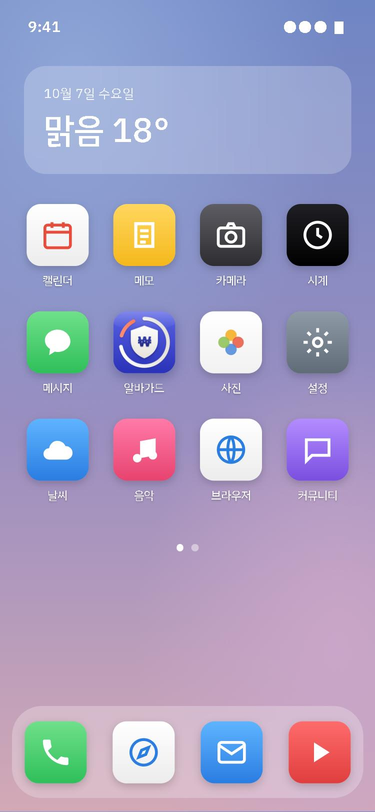

*홈 화면에 추가했을 때의 모습 (설명용 그림. 다른 앱 아이콘은 모양만 흉내 낸 것)*

<p>
  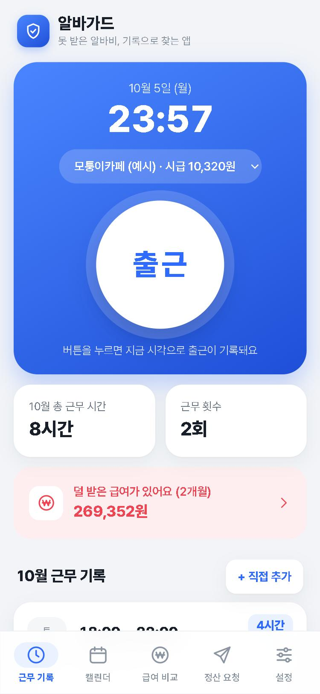
  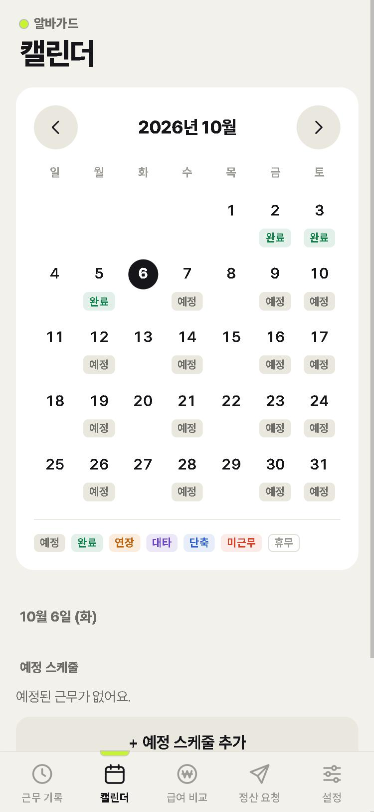
  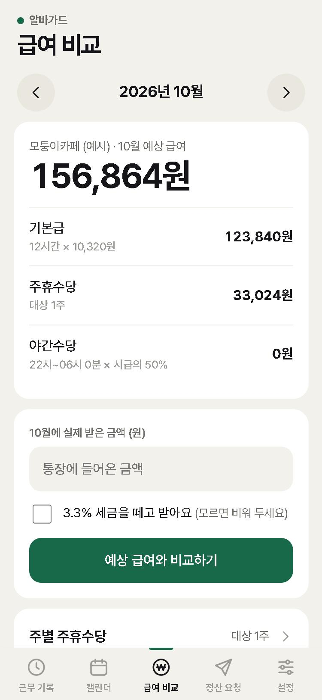
  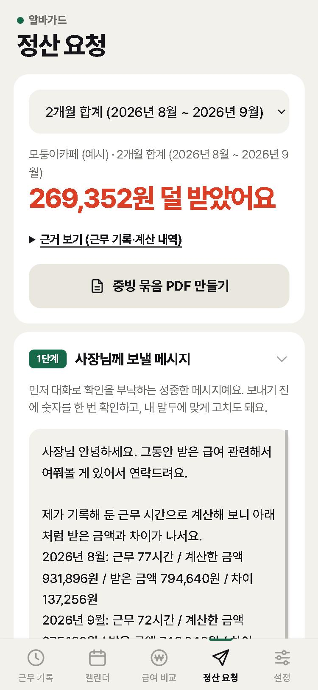
  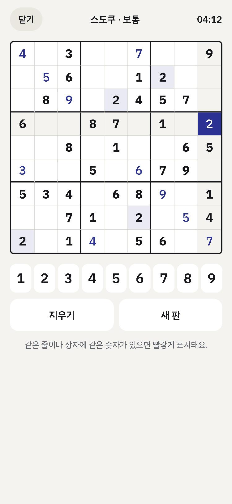
  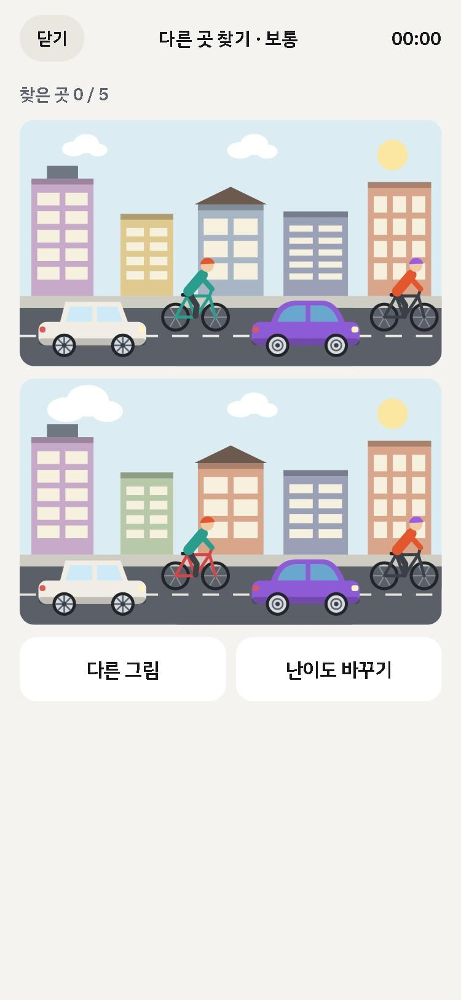
</p>

근무 기록 · 캘린더 · 급여 비교 · 정산 요청 · 스도쿠 · 틀린 그림 찾기 (예시 데이터를 넣은 화면, 2026.10.7 기준)

어두운 화면(다크 모드)도 있다. 폰 설정을 따르고, 설정 탭에서 직접 고를 수도 있다.

<p>
  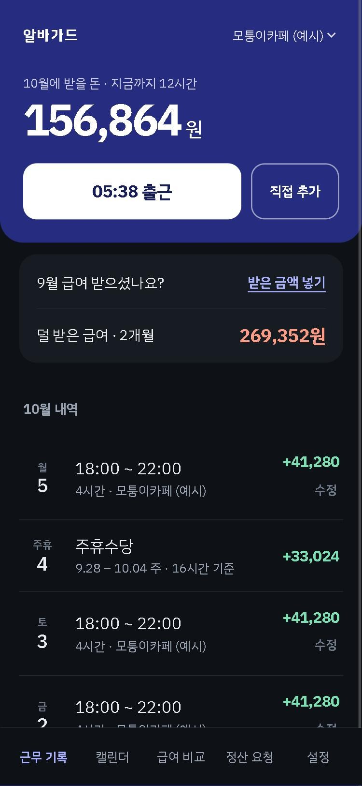
  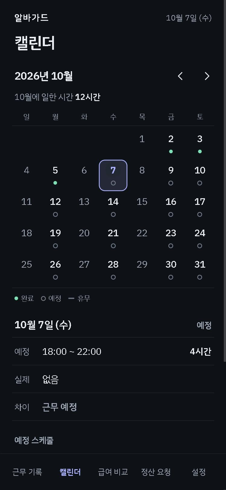
  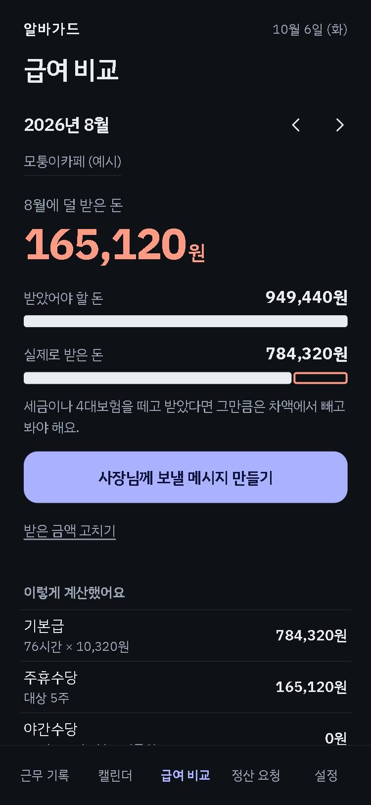
  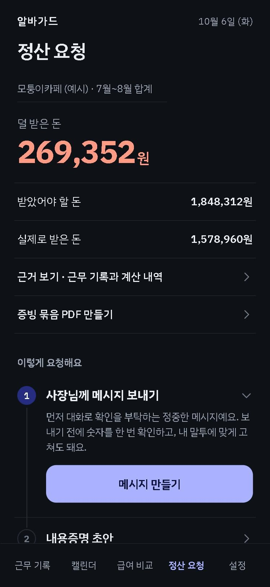
</p>

주소 끝에 `#calendar`, `#pay`, `#request`, `#workplaces`를 붙이면 그 탭이 바로 열린다.
예: https://jihooni217.github.io/albaguard/#pay

| 탭 | 화면 |
|---|---|
| 근무 기록 | 위쪽 남색 면에 이번 달 받을 돈과 큰 출근 버튼, 그 아래 퇴직금·받은 금액 확인·덜 받은 급여 알림, 근무와 주휴수당이 번 돈과 함께 쌓이는 이번 달 내역 |
| 캘린더 | 월 달력에서 평소 날은 점으로, 예정과 달랐던 날(연장·대타·단축·미근무)만 글자로 표시. 날짜를 누르면 예정·실제·차이 세 줄 |
| 급여 비교 | 받았어야 할 돈 → 받은 금액 입력 → 덜 받은 돈과 막대 두 줄 비교, 그 아래 계산 내역·주별 주휴수당(접어 둠)·증빙 사진 |
| 정산 요청 | 덜 받은 금액과 근거, 1~3단계 요청 문구와 진정 안내 (1단계만 펼쳐 두고 나머지는 눌러서 펼침) |
| 설정 | 근무지 등록·수정, 화면 밝기(폰 설정대로·밝게·어둡게), 기록 백업, 시연 도구 |

근무 중에는 위쪽 면이 더 짙은 남색으로 바뀌고 버튼이 퇴근으로 바뀌며, 출근 시각과 지난 시간이 보인다.
그 아래에 근무 중에만 열리는 "손님 없는 틈에 · 스도쿠", "손님 없는 틈에 · 틀린 그림 찾기" 줄이 나타난다.
입력 창은 화면 아래에서 올라오고, 버튼은 엄지로 누르기 좋게 크게 만들었다.

## 기능

### 1. 수정 이력이 남는 근무 기록
- 출근·퇴근 버튼으로 기록. 사장과 연결하지 않고 혼자 쓴다
- 근무할 때마다 그날 번 돈이 내역에 한 줄씩 쌓이고, 주휴수당도 한 줄로 들어온다
- 기록을 고치거나 지우면 전후 시각, 시점, 사유가 남는다. 나중에 직접 넣은 기록도 따로 표시된다
- 캘린더에 예정 스케줄을 넣어 두면 실제 근무와 비교해 완료·연장·대타·단축·미근무·휴무로 보여준다
- 사장과 합의해 쉰 날은 "합의해서 쉼"으로 표시해 결근으로 보지 않게 할 수 있다
- 출근한 지 12시간이 넘으면 퇴근을 잊은 것으로 보고 끝난 시각을 묻는다. 그날 예정 스케줄의 끝 시각을 미리 채워 주고, "나중에 입력"으로 남는다

### 2. 입금액 비교 및 차액 표시
- 예상 급여 = 기본급 + 주휴수당 + 야간수당 (그 해 최저시급보다 낮으면 경고. 2026년 10,320원, 2027년 10,700원)
- 실제 받은 금액을 넣으면 받았어야 할 돈과 받은 돈을 막대 두 줄로 비교해 차액을 알려준다. 3.3% 공제 여부를 고를 수 있다
- 무급 휴게시간, 중간에 바뀐 시급을 반영한다
- 덜 받은 급여가 있으면 첫 화면에 알림이 뜬다
- 지난 달 급여의 받은 금액을 아직 안 넣었으면 첫 화면에서 "급여 받으셨나요?"라고 물어본다
- 한 곳에서 1년 이상, 주 15시간 이상 일했으면 퇴직금 대상이라고 첫 화면에 알려주고 추정 금액(최근 3개월 급여 기준)을 보여준다. 1년이 되기 30일 전부터 알린다. 일 시작한 날은 근무지 수정에서 넣을 수 있다

### 3. 단계별 정산 요청
- 1단계 사장님께 보낼 메시지 → 2단계 내용증명 초안 → 3단계 진정 절차 안내(1350 전화, 노동포털 연결)
- 덜 받은 달이 여러 달이면 합계로 한 번에 요청할 수 있다
- 진정서를 대신 써 주거나 신고를 대행하지는 않는다
- 문구를 보낸 뒤 "보냈어요"를 누르면 보낸 날짜가 남는다. 2주가 지나도 그대로면 첫 화면에서 다음 단계를 권하고, 증빙 묶음에 "정산 요청 이력"으로 들어간다

### 4. 증빙 묶음 PDF
- 근무 기록, 수정 이력, 계산 근거, 입금 내역, 첨부 사진을 한 문서로 정리해 PDF로 저장
- 근무표·시급 근거(계약서·공고·메시지)·입금 내역을 사진으로 붙일 수 있다. 근무지를 새로 등록하면 시급이 적힌 사진을 지금 찍어 두라고 한 번 권한다
- 대타와 연장 근무가 기록마다 표시된다

### 5. 근무 중에만 열리는 머리 쓰는 게임
- 손님 없는 시간이 긴 야간·편의점 알바생을 위한 쉬는 공간. 출근 버튼을 누른 상태에서만 첫 화면에 나타나고 퇴근하면 사라진다
- **스도쿠**: 난이도 쉬움·보통·어려움. 판은 매번 새로 만들어지고 답은 항상 하나다. 같은 줄이나 상자에 같은 숫자가 있으면 빨갛게 표시된다
- 스도쿠 메모: 메모를 켜고 숫자를 누르면 그 칸에 후보 숫자가 작게 적힌다. 답을 넣으면 같은 줄·상자의 메모에서 그 숫자가 지워진다
- 스도쿠 힌트: 한 판에 3번, 빈칸 하나를 정답으로 채워 준다. 힌트를 쓴 판은 최고 기록에 남지 않는다
- 스도쿠는 하던 판과 걸린 시간이 저장되어 닫았다가 이어 할 수 있고, 난이도별 내 최고 기록이 남는다
- **틀린 그림 찾기**: 위아래 두 그림에서 다른 곳을 눌러 찾는다. 쉬움은 자동차 휠, 보통은 도심 거리의 자동차·자전거·건물, 어려움은 비스듬히 본 입체 건물의 각도나 창문 한 칸 같은 작은 차이
  - 틀린 곳을 누를 수 있는 기회는 3번. 다 쓰면 답을 보여주고 그 그림은 깬 것으로 치지 않는다 (막 눌러서 찾지 못하게)
  - 힌트 3단계: 1차는 못 찾은 것 하나가 어떤 물체인지, 2차는 못 찾은 것 전부의 특징 요약, 최종은 답을 보고 넘어가기
  - 그림마다 번호가 있고 몇 번까지 했는지 저장해서, 한 번 본 그림은 다시 나오지 않는다
- 게임 기록은 증빙 묶음이나 정산 요청 문서에 들어가지 않는다

### 그 밖에
- **기록 백업**: 모든 기록과 사진을 파일 하나로 저장하고 다시 불러온다 (설정 탭)
- **시연 도구**: 예시 데이터 넣기, 모든 데이터 지우기 (설정 탭)
- 로그인이 없고, 한 번 열어 두면 인터넷 없이도 열린다

## 다른 앱과의 차이

| 앱 | 하는 일 | 알바가드와 다른 점 |
|---|---|---|
| 기그 | 사장과 연결해 출퇴근·전자 근로계약 | 알바가드는 사장 연동 없이 혼자 쓴다 |
| 하우머치 | 혼자 기록하고 예상 급여를 보여줌 | 알바가드는 실제 받은 돈과 비교해 차액을 찾고 요청까지 간다 |
| 알바천국·알바몬 | 일회성 급여 계산기 | 알바가드는 기록이 남는다 |
| 진정24·노동포털 | 진정서 작성·접수 | 증거가 이미 있어야 쓸 수 있다. 알바가드는 그 앞 단계다 |

## 알아둘 점
- **기록은 그 폰 안에만 저장된다.** 폰을 바꾸거나 브라우저 데이터를 지우면 사라지므로 가끔 백업 파일을 만들어 둔다
- **증빙 묶음은 본인 기록을 정리한 참고 자료다.** 이 문서만으로 법적 효력이나 증거 인정이 보장되지 않으며, 통장 내역·메시지 같은 자료와 함께 내야 한다. 알바가드는 법률 자문이 아니다
- 계산에 연장근로 가산은 반영하지 않았다
- 입금 문자·급여명세서 사진에서 금액을 자동으로 읽는 기능은 아직 없다
- 폰 푸시 알림은 없다. 덜 받은 급여와 받은 금액 확인은 앱을 열었을 때 첫 화면에서 알려준다

## 수익과 지표 (린 캔버스, 2026.10)
- **수익원**: 미니게임(스도쿠·틀린 그림 찾기)에만 광고를 붙인다. 기록·급여 비교·정산 요청 화면에는 광고를 넣지 않고 무료로 둔다. 문서 유료화와 신고 대행은 하지 않는다 (법적 검토 참고). 이후 후보: 기록 신뢰성 보증·장기 보관 구독, 학교·지자체 공급
- **핵심 지표**: 설치 수, 근무지 등록 → 첫 기록 전환율, 한 달 이상 기록 지속 비율, 받은 금액 입력 비율, 차액 발견 건수·금액, 요청 메시지를 보낸 비율, 정산 요청 후 실제로 돈을 받은 비율(사용자 인터뷰로 확인). **지금 앱에는 서버가 없어 이 수치를 잴 수 없다.** 앞으로 잴 지표다
- **채널**: 에브리타임·알바 커뮤니티, 인스타·틱톡 짧은 영상, 학교 학생지원센터·청년 노동 상담 단체, 링크 공유로 친구 추천. 아직 시작한 것은 없다
- 전체 내용은 `docs/03_린_캔버스.hwpx`

## 앞으로
- **기록의 신뢰성**: 지금은 기록이 폰 안에만 있어 나중에 지어낸 것이 아님을 제3자가 확인할 수 없다. 서버에 시각을 남겨 기록이 고쳐지지 않았음을 보증하는 것이 다음 단계다
- 입금 문자·급여명세서 사진에서 금액 자동 인식
- 타겟 사용자 인터뷰 (지금까지 알바생 친구 2명의 의견으로 화면 구성과 아이콘 방향을 정했다. 정식 인터뷰는 아직이다)
- **스도쿠 주간 랭킹**: 그 주에 누가 어디까지 깼는지, 1~10등을 보여주기. 점수를 모을 서버와 닉네임이 필요해서 추후에 진행한다
- 다른 머리 쓰는 게임 (빨리 누르기, 거스름돈 암산 등)

## 개발

React + Vite. 백엔드 없음. 기록은 브라우저 localStorage, 사진은 IndexedDB에 저장한다.

처음 한 번만 `npm install`, 그다음부터는 `npm run dev`.

- 컴퓨터: 브라우저에서 http://localhost:5173
- 폰: 컴퓨터와 같은 와이파이에 연결한 뒤, 터미널에 나오는 `Network` 주소로 접속

### 배포
`main` 브랜치에 올리면 GitHub Actions(`.github/workflows/deploy.yml`)가 자동으로 빌드해 GitHub Pages에 배포한다.

### 매년 할 일: 최저임금 한 줄 추가
최저임금은 `src/lib/최저임금.js` 의 표에 연도별로 들어 있다. 앱은 근무한 날짜의 연도로 이 표에서 금액을 찾는다.
다음 해 최저임금이 발표되면(매년 8월 5일까지 고시) 표에 한 줄을 넣고 올리면 모든 사용자 앱에 반영된다.

```js
  2027: 10700,
  2028: 00000, // ← 이렇게 한 줄 추가 (숫자에 쉼표 없이, 줄 끝에 쉼표)
```

GitHub 웹사이트에서 그 파일을 열고 연필 버튼으로 고친 뒤 "Commit changes"를 눌러도 된다.
README에 적는 것으로는 반영되지 않는다. 표에 올해 금액이 없으면 앱은 가장 최근 해 금액으로 비교하고, 설정 탭에 "아직 반영되지 않았어요"라고 알린다.

### 정산 요청 문구와 Claude API (선택)
API 키 없이 모든 기능이 돌아간다. 요청 메시지와 내용증명 초안은 근무 기록을 넣은 기본 문구로 만들어진다.

Claude가 문구를 쓰게 하려면 `.env.example` 을 복사해 `.env` 로 만들고 `ANTHROPIC_API_KEY` 에 키를 넣은 뒤
`npm run dev` 를 다시 실행한다. 컴퓨터에서 띄웠을 때만 작동하고, 배포된 앱은 항상 기본 문구를 쓴다.
`.env` 는 커밋되지 않는다.

### 폴더
- `src/components/` — 화면
- `src/lib/` — 급여 계산, 연도별 최저임금(`최저임금.js`), 예정·실제 비교, 요청 문구, 백업, 사진 저장, 스도쿠 판·틀린 그림 찾기 그림 만들기
- `server/` — Claude API 호출 (개발 서버에서만)
- `public/` — 앱 아이콘, 링크 미리보기 그림, 설치 설정, 오프라인용 파일
- `docs/screenshots/` — README에 쓰는 화면 캡처. 디자인이 바뀌면 다시 찍는다

## 문서
- `docs/01_문제_정의서.hwpx`
- `docs/02_아이템_기획_및_가치_제안서.md` / `.hwpx`
- `docs/03_린_캔버스.hwpx` — 문제·고객·가치 제안·해결안·채널·수익원·비용·지표·경쟁우위 (2026.10.7, 팀원 버전 내용 반영)
- `docs/screenshots/` — 화면 캡처 6장 + 어두운 화면 4장, 둥근 모서리 앱 아이콘, 홈 화면 그림
- `CLAUDE.md` — Claude Code용 프로젝트 컨텍스트 (계산 규칙, 디자인, 법적 검토 메모)
